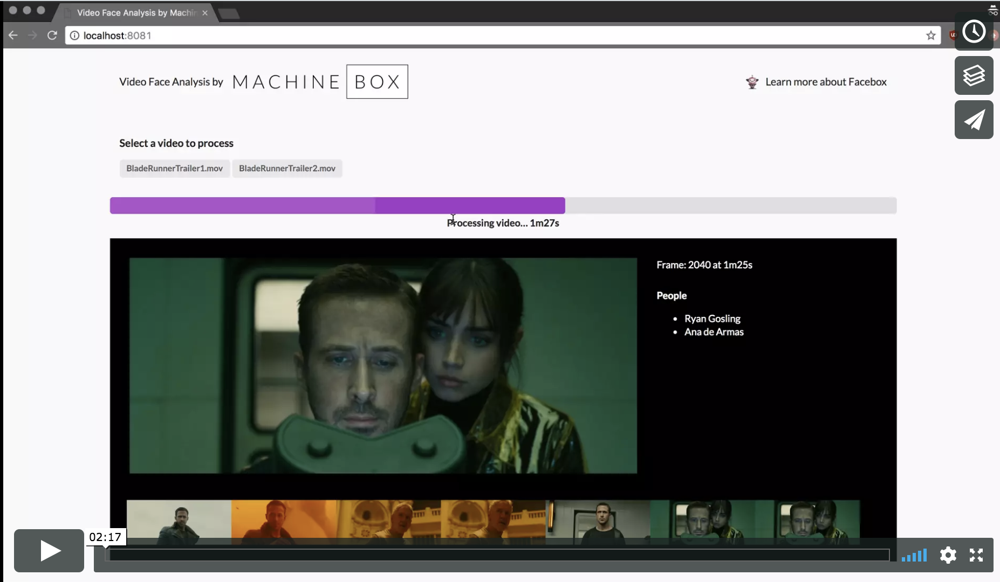

# Video Analysis

With this little app you can process video frames with Go, using a little Python script, allowing video pipelines and workflows. Here we implement a Face Recognition pipeline using [Facebox](https://machinebox.io/docs/facebox).

Check out the blog post https://blog.machinebox.io/processing-video-to-do-face-recognition-with-go-and-python-298275a26095

## Requirements

* Go
* Python 2 and OpenCV
* Facebox

## Video Samples

Leave your videos under `./videos` and the app will load the videos on the startup

